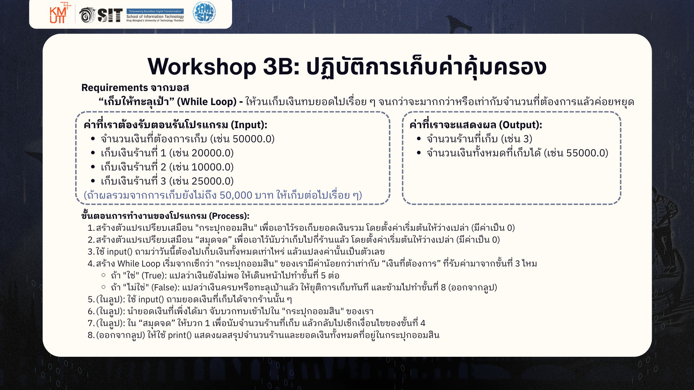
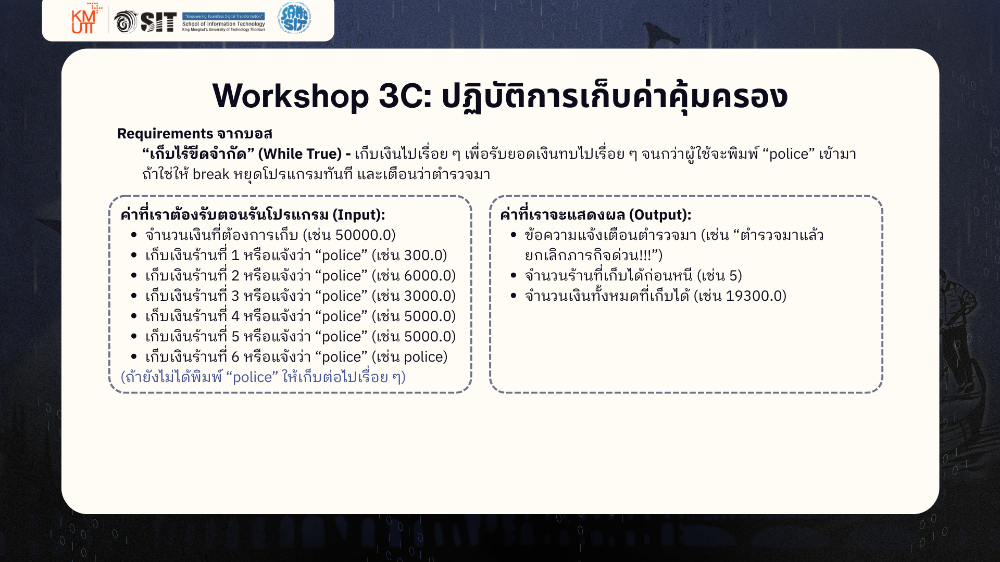

# IT Starter Pack #32 / Basic Programming Workshop 3

## Instructions

1. Fork repo นี้ไปเป็นของตัวเอง
2. Clone repo ลงเครื่องของน้อง
3. เปิด Repo นั้นใน VS Code
4. สร้างไฟล์ใหม่ขึ้นมา ตั้งชื่อว่า `workshop3.py` แล้วทำตามโจทย์ได้เลย
5. ทำเสร็จ ใช้ GitHub Workflows เพื่ออัปโหลดงานของตัวเองขึ้น Remote repo ดังนี้

5.1 add

```bash
git add .
```

5.2 commit

```bash
git commit -m "add workshop 3"
```
> [!NOTE]
> ถ้าน้องเจอ error แบบนี้:
> ```bash
> *** Please tell me who you are.
> 
> Run
> 
>   git config --global user.email "you@example.com"
>   git config --global user.name "Your Name"
> 
> to set your account's default identity.
> Omit --global to set the identity only in this repository.
> 
> fatal: unable to auto-detect email address (got 'username@hostname.(none)')
> ```
> แปลว่าน้องยังไม่ได้ config user.name หรือ user.email ซึ่งน้องสามารถ config ได้ดังนี้:
> ```bash
> git config --local user.name "<ชื่อของน้อง>"
> git config --local user.email "<อีเมลของน้อง>"
> ```

5.3 push

```bash
git push
```

6. แจ้งพี่ ๆ พร้อม GitHub username ของน้องว่างานของน้องเสร็จแล้ว แล้วพี่ ๆ จะเข้าไป comment งานของน้องเองงงง

## workshop A


---
## workshop B


---
## workshop C



---
